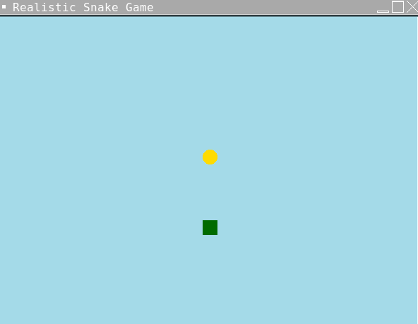

# Snake Game

A simple Snake Game built using Python's `turtle` module.

## Features

- Classic Snake gameplay.
- Use the `W`, `A`, `S`, `D` keys to control the snake.
- Eat food to grow the snake longer.
- Avoid hitting the walls or yourself!

## Requirements

To run this game, you need Python 3.x installed on your system.

### Install the turtle module

The `turtle` module comes pre-installed with Python, so no additional dependencies are needed.

## How to Run the Game

1. Clone the repository:
    ```bash
    git clone https://github.com/your-username/snake-game.git
    cd snake-game
    ```

2. Run the game:
    ```bash
    python snake_game.py
    ```

## Screenshots

  <!-- Add a screenshot here later -->

## Contributing

If you'd like to contribute, please fork the repository and use a feature branch. Pull requests are warmly welcome.

## License

This project is open-source and available under the [MIT License](LICENSE).

